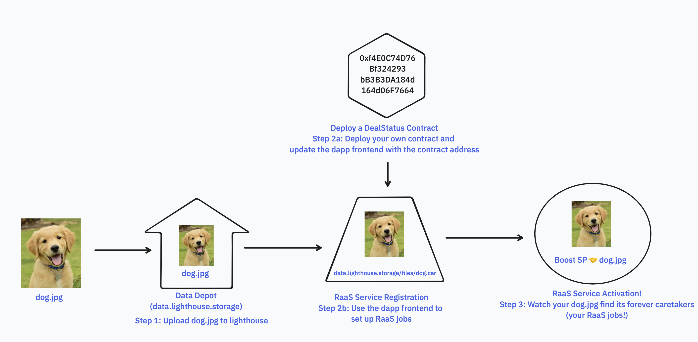

# Lighthouse SDK

## Quickstart: Uploading Your First 🐕 Onto Filecoin

### Upload your first file through the lighthouse SDK

Firstly, you'll need to get a picture of your favorite pupper whose picture you'll want to immortalize on the internet.



Think of the lighthouse SDK as a doggy daycare and the RaaS (renew, repair, replication) services as its caretaker. The lighthouse SDK provides a place for your puppy to stay while the services take care of your dog and makes sure it's fed and healthy. In this case, lighthouse provides storage while the RaaS services takes care of your file and makes sure it's stored on the Filecoin network permanently. 

The lighthouse SDK is a JavaScript library that allows you to upload files to the Filecoin network. It's open source and available [here](https://github.com/lighthouse-web3/lighthouse-package)

Uploading a file is as simple as:

```javascript
import lighthouse from "@lighthouse-web3/sdk";
// ... other code
const uploadResponse = await lighthouse.upload('/path/to/adorable/dog.jpg', 'YOUR_API_KEY');
```

Previously, if the file of your puppy was too small, it would encounter issues being stored on chain due to size minimums enforced by on-chain deal makers. The SDK helps you get around this by adding mock data to your file to meet the minimum size requirements.

When you upload a file without any RaaS services, you've only uploaded one copy of your file to the Filecoin network. There's no guarantee that if the file's deal term expires or is no longer being maintained by the storage provider, that you'll be able to retrieve your file. This is where the RaaS services come in.

Replication is the process of making copies of your file and storing them on the Filecoin network. This ensures that if one storage provider goes down, you'll still be able to retrieve your file from another storage provider.

Here's an example of how to upload a file with replication:

```javascript
import lighthouse from "@lighthouse-web3/sdk";
// ... other code
// Indicates that the deal to maintain your file will be replicated to a total of two copies on the network.
const dealParams = {
  num_copies: 2,
};
// The `false` indicates that we're uploading a single file.
// Returns a CID (Content ID) for your file that you can use for PoDSI verification.
const uploadResponse = await lighthouse.upload('/path/to/adorable/dog.jpg', 'YOUR_API_KEY', false, dealParams);
```

### Getting the PoDSI for your file

Now that you've registered the picture of your puppy, how would you know that it's actually being maintained on the Filecoin network? This is where the PoDSI comes in. The PoDSI is a proof that your file is being maintained on the Filecoin network. 

The time between upload and being able to get your PoDSI should only be a few minutes. You can get the PoDSI for your file by calling the `getProof` function in one of the following ways:

```bash
# Assumes that uploaded your file to mainnet.
# Alternatively, if you are using testnet, add &network=testnet to the end of the URL.
curl https://api.lighthouse.storage/api/lighthouse/get_proof?cid=<puppy_CID>
```

```javascript
let response = await axios.get("https://api.lighthouse.storage/api/lighthouse/get_proof", {
    params: {
        cid: lighthouse_cid,
        network: "testnet" // Change the network to mainnet when ready
    }
})
```

### Get your deal ID from your upload
When you upload the picture of your puppy, the on-chain deal that is made to store it on the Filecoin network is assigned a unique deal ID. You can get this deal ID the same way you get the PoDSI for your file. In the above, it would be accessible through `response.data.deal_id`.

Under the hood, the node infrastructure is working hard to ensure that your file is included on-chain. The process can take up to about **an hour**.

### Download your file using the file’s CID
Now that your file is stored on the Filecoin network, you can retrieve it using the file's CID. You can do this by calling the `download` function in one of the following ways:

```bash
# Assumes that you have lighthouse-cli installed. If not, feel free to download it using 
# npm install -g @lighthouse-web3/sdk
lighthouse-web3 decrypt-file <CID>
```

```javascript
let response = await axios({
    method: 'GET',
    url: `${lighthouseDealDownloadEndpoint}${lighthouse_cid}`,
    responseType: 'stream',
});

try {
    const filePath = await this.saveResponseToFile(response, downloadPath);
    console.log(`File saved at ${filePath}`);
    return filePath
} catch (err) {
    console.error(`Error saving file: ${err}`);
}

saveResponseToFile(response, filePath) {
    const writer = fs.createWriteStream(filePath);

    // Pipe the response data to the file
    response.data.pipe(writer);

    return new Promise((resolve, reject) => {
        writer.on('finish', () => resolve(filePath));
        writer.on('error', (err) => {
            console.error(err);
            reject(err);
        });
    });
}
```

### Why does all this matter?

We see a bright future in enabling permanent, immutable, decentralized data-storage for developers. 

The interface for the lighthouse SDK is designed to be simple and easy to use. We hope that this will enable developers to easily integrate the Filecoin network as the primary data storage provider for their applications.

More importantly, this enables developers to build novel applications. Imagine a dapp or DAO that can be built to incentivize, analyze and store upload metadata on-chain. There are a couple of examples of this:

- Rewarding $TOKEN based on the upload of a particular file and their CID.
- Being able to track CIDs and deal IDs onchain for verification and airdropping.
- Building more advanced, robust DataDAOs (check out the starter kit [here](https://github.com/filecoin-project/fevm-data-dao-kit)!)

### Appendix

For more information, check out the following code examples to upload files:

1. [NodeJS Code Examples](../lighthouse-sdk/code-examples/nodejs-backend/)
2. [Frontend(React, Next..) Code Examples](../lighthouse-sdk/code-examples/browser-frontend/)
3. [Lighthouse File](https://files.lighthouse.storage/)

You can also check out the following documentation to learn more about various other jobs you can register

1. [Registering a job](../deal-parameters.md)

**Note**: Deal by default using SDK will go to the mainnet unless deal parameters are provided mentioned [here](../javascript/functions/upload.md).

A full flow diagram of the lighthouse SDK can be found below:

<figure><figcaption></figcaption></figure>
