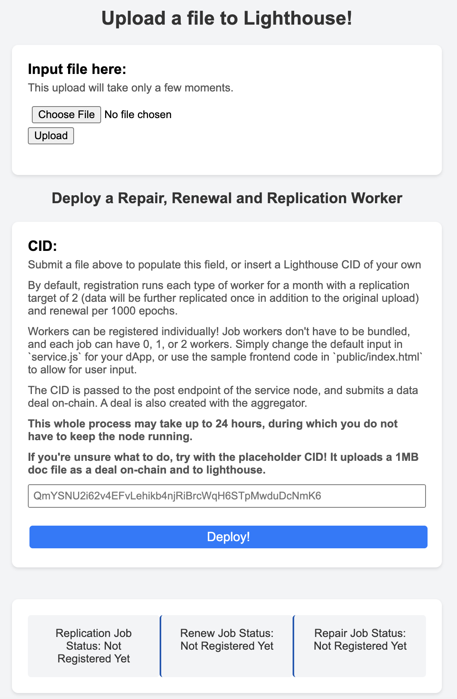

# RaaS Service Overview

## Self-hosted and Aggregator-Hosted RaaS Interfaces

RaaS (renew, repair, replication) interacts with smart contracts to figure out which on-chain data deals to perform its services on. Specifically, it can interact with one of two types of interfaces:

- Aggregator-hosted RaaS: A user relies on an existing FVM contract deployment to submit and complete data deals. Usually, the deployment is verified and maintained by storage infrastructures such as Lighthouse.
- Self-hosted RaaS: A user deploys a smart contract that inherits from [`IAggregatorOracle.sol`](https://github.com/xBalbinus/fevm-data-segment/blob/main/contracts/aggregator-oracle/IAggregatorOracle.sol) which allows them to rely on their own contract deployment to submit and complete data deals.

Among the two interfaces, some important common features stand out:

<table><thead><tr><th width="69">#</th><th width="196">Function Name</th><th width="174">Purpose</th><th width="155">Key Parameters</th><th>Outcome</th></tr></thead><tbody><tr><td>1</td><td><code>submit</code></td><td>Function that submits a new deal request to the oracle. Critical in all RaaS functionalities.</td><td><code>_cid</code></td><td><code>Event: SubmitAggregatorRequest</code></td></tr><tr><td>2</td><td><code>getAllDeals</code></td><td>Get all deal IDs for a specified cid</td><td><code>_cid</code></td><td><code>Deal[]</code></td></tr><tr><td>3</td><td><code>getActiveDeals</code></td><td>return all the _cid's active dealIds. Critical for replication deals.</td><td><code>_cid</code></td><td><code>Deal[]</code></td></tr><tr><td>4</td><td><code>getExpiringDeals</code></td><td>return all the deals' dealIds if they are expiring within <code>epochs</code>. Critical for renewal and repair jobs.</td><td><code>_cid, epochs</code></td><td><code>Deal[]</code></td></tr></tbody></table>

## Interacting with the Smart Contract

First, you'll need to either:
- Use an existing instance of the aggregator-hosted RaaS (hosted by Lighthouse) located at 
  - **Calibration Testnet**: `0x6ec8722e6543fB5976a547434c8644b51e24785b`
- Or start an instance of the self-hosted RaaS by deploying a contract that inherits from `IAggregatorOracle` (`yarn deploy` in the [RaaS Starter Kit](https://github.com/filecoin-project/raas-starter-kit))

You can then interact with the smart contract by submitting a CID of your choice to the `submit` function. This will create a new deal request that will be picked up by the RaaS services.

```javascript
// contractInstance is the address of the contract you deployed or the aggregator-hosted RaaS address above.
const dealStatus = await ethers.getContractAt("DealStatus", contractInstance);
// Submit the CID of the file you want to upload to the Filecoin network in the following way.
await dealStatus.submit(ethers.utils.toUtf8Bytes(newJob.cid));
```

The CID of the file comes from submitting the deal to Lighthouse. Recall from [Section A](./section-a.md) that there are two ways to upload a file to Lighthouse:

With the Lighthouse SDK, uploading a file is as simple as:

```javascript
import lighthouse from "@lighthouse-web3/sdk";
// ... other code
const uploadResponse = await lighthouse.upload('/path/to/adorable/dog.jpg', 'YOUR_API_KEY');
```

Alternatively, [RaaS Starter Kit](https://github.com/filecoin-project/raas-starter-kit) comes with a frontend that allows you to upload your file to Lighthouse, get a CID for the uploaded file, then seamlessly submit the CID to the smart contract (accessible via `yarn start`). 



But first, you'll need to know how to register the various RaaS workers. **RaaS functionality will not function automatically if deals are only created using submit function.**

## Add Replication, Renewal, Repair Workers

You can add workers to perform replication, renewal, and repair jobs by having them listen to the `SubmitAggregatorRequest`. The methods for doing so differ between the aggregator-hosted and self-hosted interfaces.

With aggregator-hosted interfaces you can register RaaS workers for any CID (including ones of files you didn't upload) by making a POST request to **`https://calibration.lighthouse.storage/api/register_job`** with your CID as the body of the request. 

```bash
# Example of registering a job
curl -X POST https://calibration.lighthouse.storage/api/register_job \
     -H "Content-Type: application/x-www-form-urlencoded" \
     -d "cid=QmYSNU2i62v4EFvLehikb4njRiBrcWqH6STpMwduDcNmK6"
```

You'll then be able to query the deal's status using the `deal_status` endpoint

```bash
# Example of how to query a job's status using its CID
curl -X GET "https://calibration.lighthouse.storage/api/deal_status?CID=your_CID_here"
```

If you are using the **lighthouse SDK**, you'll only need to add a few more parameters to the `dealParams` object when uploading your file to register RaaS services hosted by the Lighthouse aggregator:

```javascript
import lighthouse from "@lighthouse-web3/sdk";
// ... other code

// Deal params should include the settings for RaaS jobs
const dealParams = {
  num_copies: 2,
  repair_threshold: 28800,
  renew_threshold: 240,
};

const uploadResponse = await lighthouse.upload('/path/to/adorable/dog.jpg', 'YOUR_API_KEY', false, dealParams);
```

If you're hosting your own RaaS service (specifically, the one in the [RaaS Starter Kit](https://github.com/filecoin-project/raas-starter-kit)), there's an event listener inside that you can use to listen for new deal requests.

To use this, simply do `yarn service` in the terminal and proceed through the frontend as you normally would - uploading any random file, and then registering the workers using the autocompleted CID that appears in the box. If you want to register the workers manually for a job that you didn't upload, simply paste in the known CID of your file and register the jobs anyway. For more information, check out the [RaaS Starter Kit README](https://github.com/filecoin-project/raas-starter-kit#readme)

## Why Does This Matter?
Building a decentralized application (dApp) or a Decentralized Autonomous Organization (DAO) to incentivize replications, renewals, and repairs of existing data could create a more resilient and economically sustainable data storage ecosystem. Some unique applications include:

- Rewarding $TOKEN for the replication of a useful piece CID (deemed valuable by the TOKEN protocol).
- Building perpetual storage solutions with RaaS workers.

## Appendix

For more information, check out the full flow below.

<figure><figcaption></figcaption></figure>

